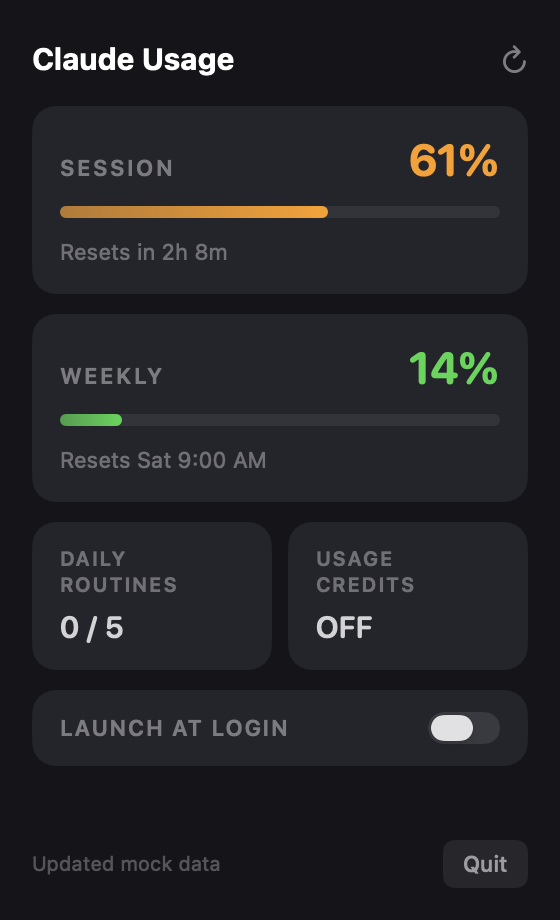
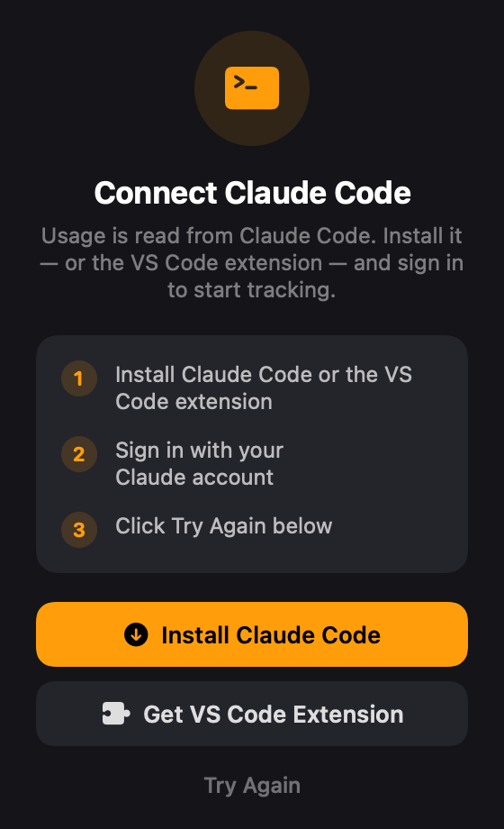
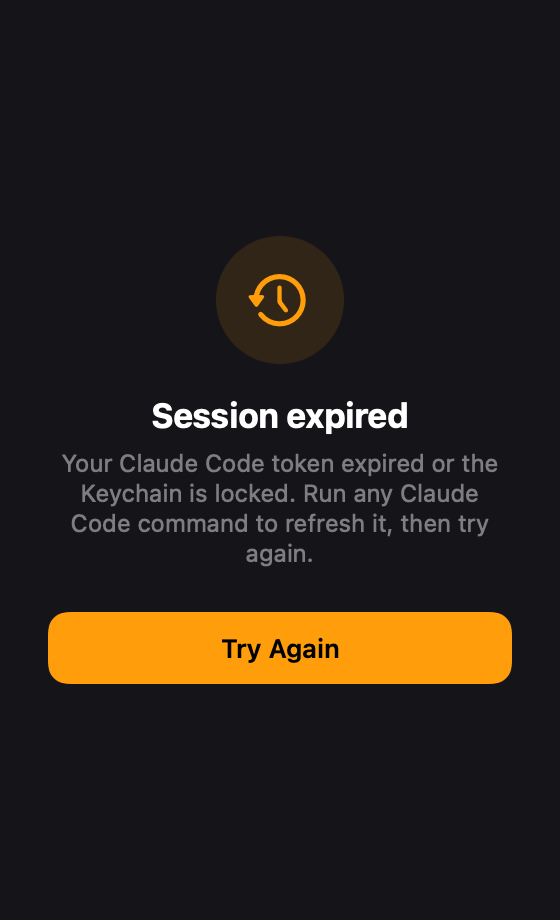
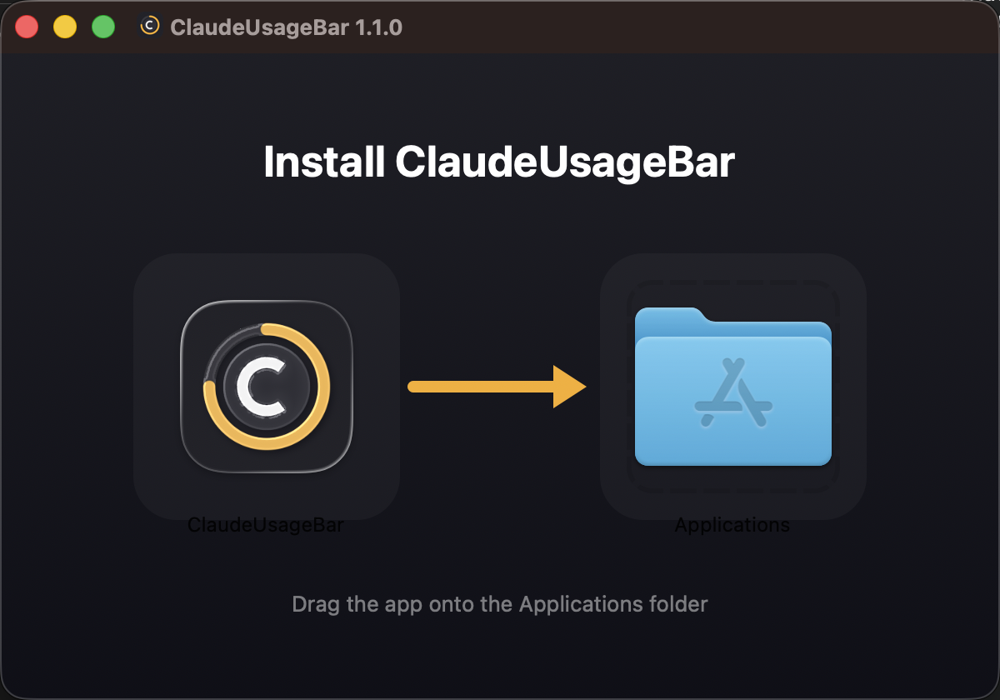

<p align="center">
  
</p>

<h1 align="center">Claude Usage</h1>

<p align="center">
  A lightweight macOS menu bar app that shows your Claude Pro/Max usage in real time.
</p>

<p align="center">
  
  
  
  
</p>

---

## Overview

**Claude Usage** lives in your menu bar and keeps you informed about your Claude session at a glance — no browser tabs, no digging through settings.

```
🟠 61% · 2h 8m
```

The menu bar title is color-coded and always reflects the real state:

| State | Menu bar |
|-------|----------|
| Active session | `🟢 / 🟠 / 🔴  61% · 2h 8m` |
| No active session | `○ No session` |
| Token expired | `⚠ Expired` |
| Not signed in | `○ Sign in` |

Click the icon to open the detail popover.

---

## Screens

<table>
<tr>
<td align="center" width="33%">
<br>
<b>Usage</b><br>
<sub>Session, weekly, routines & credits</sub>
</td>
<td align="center" width="33%">
<br>
<b>Connect Claude Code</b><br>
<sub>Shown when no credentials are found</sub>
</td>
<td align="center" width="33%">
<br>
<b>Session expired</b><br>
<sub>Token expired or Keychain locked</sub>
</td>
</tr>
</table>

The main popover shows:

- **Session usage** — 5-hour rolling window with a live countdown
- **Weekly usage** — 7-day window with reset day/time
- **Daily Routines** — quota at a glance
- **Usage Credits** — ON/OFF status
- **Launch at Login** toggle
- One-click **Refresh** and **Quit**

When the token expires it no longer pretends you're signed out — it shows a clear **Session expired** screen and refreshes automatically the next time you use Claude Code.

---

## Features

- **Real-time data** — polls the Anthropic usage endpoint every 5 minutes, with a 60-second local countdown in between
- **Color-coded indicators** — 🟢 0–60% · 🟠 61–85% · 🔴 86–100%
- **Accurate auth states** — tells "not signed in", "expired/locked", and "active" apart instead of showing a misleading sign-in screen
- **Flexible credential lookup** — honors `CLAUDE_CONFIG_DIR`, the default `~/.claude`, and the macOS Keychain
- **Zero dependencies** — pure Swift + SwiftUI/AppKit, no Node, no Electron
- **Tiny footprint** — menu-bar only, no Dock icon
- **Launch at Login** — via `SMAppService`

---

## Requirements

- macOS 13 Ventura or later
- [Claude Code](https://claude.com/claude-code) **or** the [Claude Code VS Code extension](https://marketplace.visualstudio.com/items?itemName=anthropic.claude-code), installed and signed in

> The app reads your existing Claude Code OAuth token — there is no separate login.

---

## Installation

### Option A — DMG (recommended)

1. Download the latest `ClaudeUsageBar-x.x.x.dmg` from [Releases](../../releases)
2. Open the DMG and drag **ClaudeUsageBar** onto **Applications**
3. Launch it from Applications

<p align="center">
  
</p>

> On first launch, macOS may ask to allow access to the *Claude Code-credentials* Keychain item — click **Always Allow**.

### Option B — Build from source

```bash
git clone https://github.com/rtoedz/menubar-claude-usage.git
cd menubar-claude-usage
./make_app.sh
cp -R ClaudeUsageBar.app ~/Applications/
open ~/Applications/ClaudeUsageBar.app
```

> **Tip:** Install to `~/Applications/` (not just run from the project folder) so Launch at Login persists.

---

## How it works

Claude Usage reads your OAuth token from the same places Claude Code stores it, in order:

1. `$CLAUDE_CONFIG_DIR/.credentials.json` (if the variable is set)
2. `~/.claude/.credentials.json`
3. macOS Keychain — service `Claude Code-credentials`

It then calls `https://api.anthropic.com/api/oauth/usage` directly with `URLSession` — no subprocess, no extra runtime.

If the token can't be read or the API returns `401`, the app distinguishes a genuine sign-out (no credentials anywhere) from an expired/locked token (credentials present), and shows the matching screen.

---

## Build & distribute

```bash
# Dev run (no bundle features like Launch at Login)
swift run

# Build the release .app bundle
./make_app.sh

# Package a distributable DMG installer
./make_dmg.sh
```

The DMG background (title, arrow, Applications icon) is generated by `scripts/generate_dmg_background.swift` and embedded automatically by `make_dmg.sh`.

---

## Project structure

```
Sources/ClaudeUsageBar/
├── main.swift          Entry point
├── AppDelegate.swift   NSStatusItem + NSPopover wiring
├── UsageManager.swift  API fetch, polling, model, login item
└── PopoverView.swift   SwiftUI dark popover + setup/expired screens
Resources/
├── AppIcon.icns        App icon (all sizes)
└── dmg-background.png   DMG installer window background
scripts/
├── generate_icon.swift            Regenerates AppIcon.icns
└── generate_dmg_background.swift   Regenerates the DMG background
assets/                 README screenshots
Info.plist              Bundle config (LSUIElement, bundle ID)
make_app.sh             Builds the release .app bundle
make_dmg.sh             Packages the app into a DMG installer
```

---

## Debug flags

| Variable | Effect |
|----------|--------|
| `CUB_DEBUG_POPOVER=1` | Renders the popover in a standalone window for screenshots |
| `CUB_TEST_LOGIN=1` / `=0` | Enables / disables the Launch-at-Login item on launch |

---

## Notifications

Usage-threshold notification code (alerts at 80% / 95%) is included but **disabled**: macOS suppresses `UserNotifications` for ad-hoc-signed apps. To enable banners, sign the bundle with a Developer ID certificate and re-enable the two call sites noted in `UsageManager.swift`.

---

## Contributing

Contributions are welcome — open an issue or a pull request.

1. Fork the repo
2. Create a feature branch (`git checkout -b feat/my-feature`)
3. Commit your changes
4. Open a Pull Request

---

## License

MIT — see [LICENSE](LICENSE) for details.
